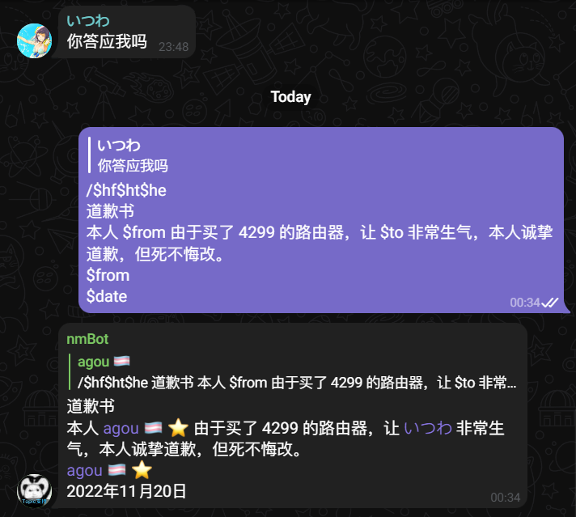

# 群友互动
在群组中，以 nmBot 为桥梁，与其他群成员进行亲切友好的互动——无需担心密接感染 COVID-19。  
你可能在其他机器人上见过这种形式，但 nmBot 有一些新的东西——让我们一睹为快。

## “群友互动”的触发方式
如果你所在群组的管理员启用了“群友互动”功能，你只需要尝试回复给你想互动的对象，并且随便写点什么，就能立刻看到效果。  

看，它就这样工作了。  
当然，你不一定非要对别人出这招，你还可以对自己使用，谁都不回复就可以了——对于社恐人士非常友好！

你回复 nmBot 发送的消息时，nmBot 会自动识别到你要回复给群友，所以你不必回复给群友发送的消息，回复 `xx xx 了 xx！` 就可以啦。

## 让我们来看看高级点的操作
不觉得感叹号前面空空的吗？让我们试试在那里加些什么。  
只需要打一个空格，并在空格后写点什么，就能把文字加到群友后面了。

……虽然不知道什么路由器那么贵，不过我们已经达到目标了。  
可是，如果要在前半部分想打一个空格，该怎么办？  
你先别急，看完下一节，你一定会明白的。

## 往消息里再加点料
话不多说，我们来看这个例子：

```/$hf$ht$he  
道歉书  
本人 $from 由于我买了 4299 的路由器，让 $to 非常生气，本人诚挚道歉，但死不悔改。   
$from  
$date```
哦，这些 `$` 开头的都是什么东西？为什么我没有在 nmBot 的消息中看到？  
不要惊讶，这些是可在消息中任意插入的特殊参数。

| 参数 | 作用 |
|:---|:---|
| `$from` | 替换为你的名字 |
| `$to` | 替换为你回复的对象的名字 |
| `$date` | 替换为当前日期 |
| `$time` | 替换为当前时间 |
| `$bot` | 替换为 nmBot 的名字 |
| `$hf`, `$hidefrom` | 忽略消息自带的你的名字，例如 `我 吃了 你！` 中的“我” |
| `$ht`, `$hideto`, `$hidetarget` | 忽略消息自带的回复对象的名字 |
| `$he`, `$hideexclamation` | 忽略消息结尾自带的感叹号 |
| `$hl`, `$hidele` | 忽略消息自带的“了” |
| `$space` | 插入空格 |

我想，现在你应该会插入空格了。可不要眼高手低，快去群组试试手吧！